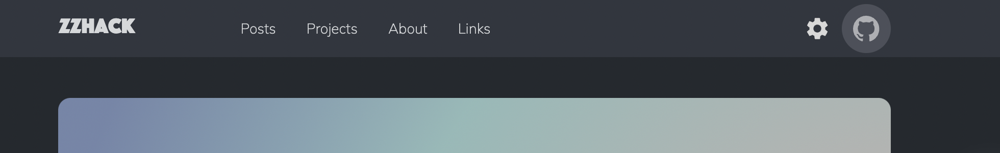
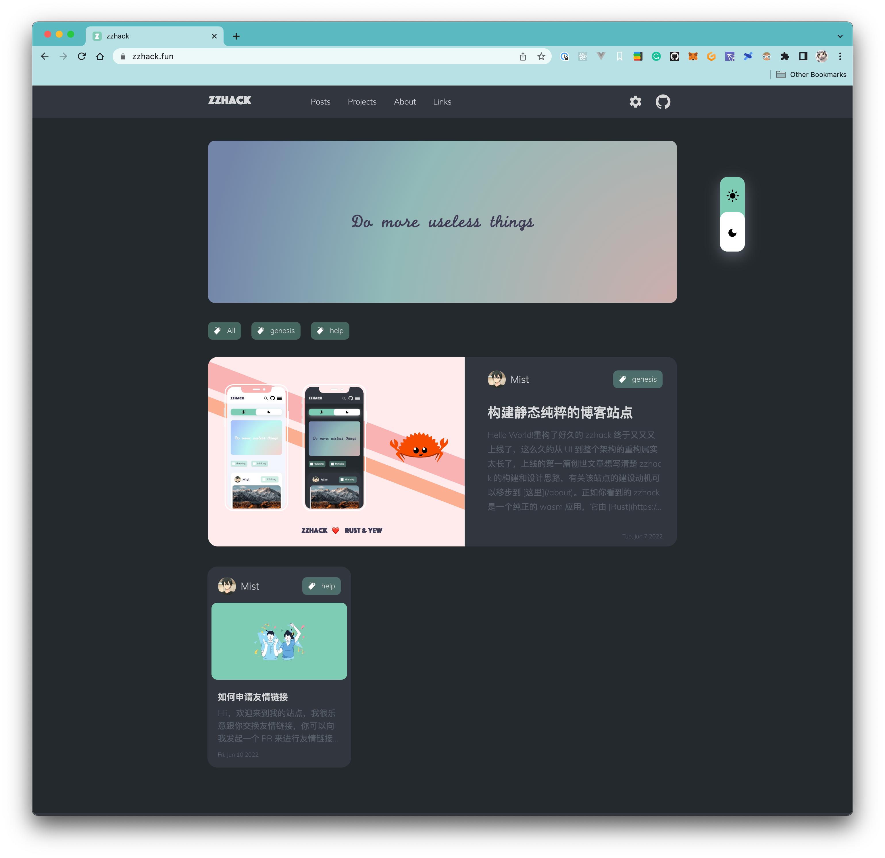
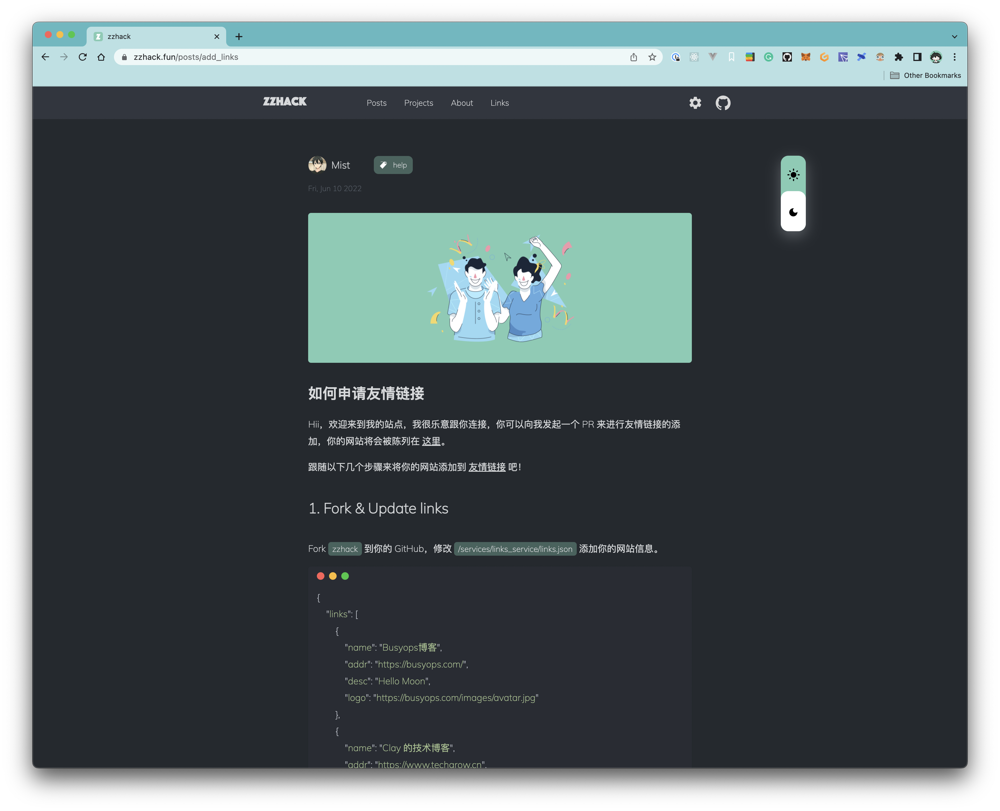
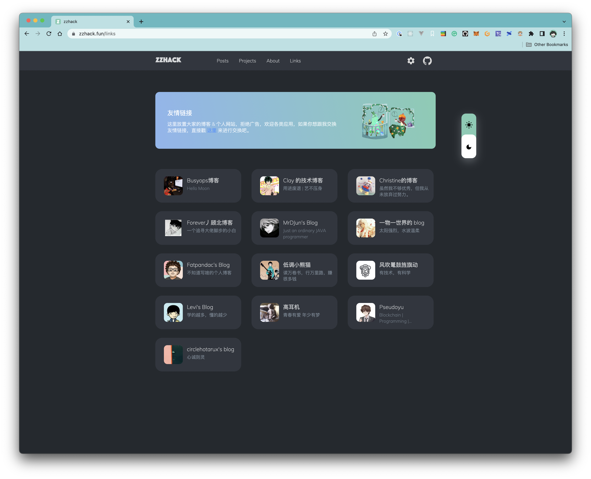
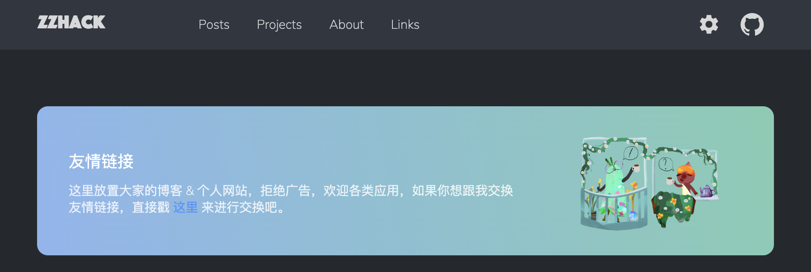
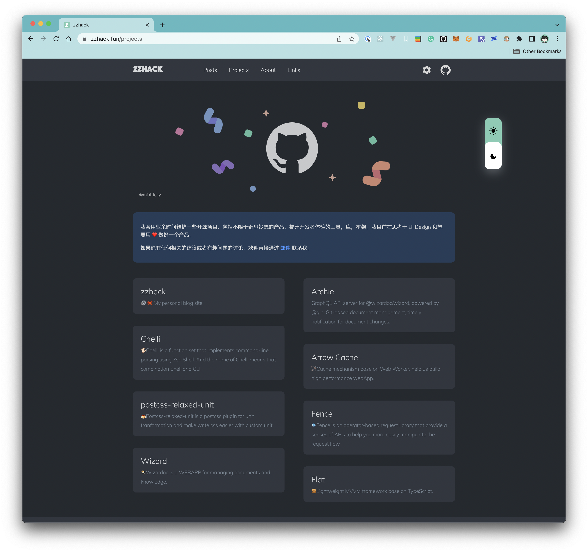

```metadata
{
    "cover": "./public/wiki_cover.png",
    "tag": "help",
    "title": "如何使用 zzhack-cli 构建 WASM WebApp"
}
```

`zzhack-cli` 是一个帮助你快速生成一个 WASM WebApp 的工具，它的 UI 模板来自 [zzhack](https://github.com/zzhack-stack/zzhack)，点击 [Live Demo](https://zzhack.fun) 了解更多。

--

中文文档 | [English](#)

### 快速开始
[zzhack](https://github.com/zzhack-stack/zzhack) 是 [Rust](https://www.rust-lang.org/) 编写的 webapp，所以你需要先准备 Rust 的开发环境，访问 [Rust Book](https://doc.rust-lang.org/cargo/getting-started/installation.html) 了解更多。


如果你已经有 [Rust](https://www.rust-lang.org/) 的开发环境了，但在开始之前你还需要安装一些前置依赖，复制下面的命令到你的终端以安装它们。
```sh
cargo install trunk zzhack
```

接下来让我们启动你的第一个 WASM WebApp 吧!
```sh
zzhack init & zzhack serve
```

## 配置
如果你需要更定制化你的 webapp，zzhack 提供一套[配置](#配置)让你可以根据配置来定制化你的应用，值得一提的是，你可以按需定制你的 webapp，除了 `pages` 是必须的其他都是可选的配置项。

```json
{
    "app": {
        // 应用名称，等同于 <title></title>
        "name": "", 
        // 关键字，等同于 <meta name="keywords" />
        "keywords": "", 
        // 应用描述，等同于 <meta name="description" />
        "description": "", 
        // 应用 logo
        "logo": ""
    },
    // 作者信息，它会被展示在文章渲染的地方
    "profile": { 
        // 作者名称
        "name": "zzhack", 
        // 作者头像
        "avatar": "" 
    },
    // 在 Header 展示 GitHub 按钮，快速链接到你的 GitHub 
    "github_bar":"https://github.com/mistricky",    
    // 指定你需要暴露的静态资源目录，如：
    //
    // "resource_dir": "./foo"
    //      |- bar.png
    // 
    // 访问 domain/foo/bar.png 获取对应的静态资源
    "resource_dir": "./foo", 
    // 页面配置，值得注意的是，pages 的第一个配置项为 “首页” 配置项，点击 logo 会返回首页 
    "pages": [ 
        {
            "name": "foo", // 页面名称，会应用在 tab 名称
            "route": "home", // 路由名称（可选），如果没有指定会回退使用页面名称作为路由
            "template": "post", // 页面 post 模板
            "source": "./foo.md" // post 模板所需渲染的文章路径
        },
        {
            "name": "posts",
            "template": "posts", // 页面 posts 模板
            "banner": "", // （可选）posts 模板 banner 图片
            "source": "./posts" // posts 模板所需渲染的文章集合的路径
        },
        {
            "name": "links",
            "template": "links", // 页面 links 模板
            "banner_text": "", // links 页面 banner 文字内容
            "source": "./links.config.json" // links 模板所需配置文件
        },
        {
            "name": "projects",
            "template": "projects", // 页面 projects 模板
            "source": "./projects.config.json" // projects 模板所需渲染的项目配置文件
        }
    ],

    "footer": {
        "copyright": "", // 展示在 footer 最底部
        // 在 footer 上展示联系方式
        "contacts": [ 
            {
                "icon": "", // 联系方式的 icon
                "link": "", // 联系方式点击后需要跳转的链接
                "icon_size": 30 // （可选）icon_size 默认为 30
            }
        ]
    }
}
```

### GitHub Bar `github_bar`


## 静态资源
配置提供一个名叫 `resource_dir` 的字段能让你配置你的静态目录，例如：
```json
// zzhack.config.json
{
    // ...
    "resource_dir": "./public"
}
```
此时当前目录下的 `public` 会被直接映射到 `domain/public` 下。

值得一提的是，当 `zzhack.config.json` 中有配置图片资源时，配置里的图片资源路径都是相对于 `resource_dir` 的，例如：
```json
{
    "resource_dir": "./public",
    // ...
    "app": {
        // ...
        "logo": "foo.png"
    },
    "profile": { 
        // ...
        "avatar": "bar.png" 
    },
}
```
应用启动时会自动拼上 `resource_dir` 的路径，去 `./public/foo.png` 和 `./public/bar.png` 查找到这些静态资源。

## 模板
[zzhack](https://github.com/zzhack-stack/zzhack) 目前提供四种页面模板用于快速构建 wasm 应用页面。

- posts
- post
- links
- projects

### Posts
提供一种展示文章列表的模板：
- `source` 字段为提供文章集合的目录路径 (e.g. `"./posts"`)
- `banner` (optional) 头部 banner 图片路径（相对于 `resource_dir`）


### Post
提供一种单文章展示的模板：
- `source` 字段为提供文章集合的目录路径 (e.g. `"./post.md"`)


### Links
提供一种展示友情链接页面的模板：
- `source` 字段为提供友情链接配置的路径 (e.g. `"./links.json"`)
- `banner_text` 友情链接 banner 处文案



**banner_text**


一个友情链接配置形如：
```json
{
    "links": [
        {
            "name": "zzhack 的博客",
            "addr": "https://zzhack.fun",
            "desc": "一个有血有肉的 WASM 站点",
            "logo": "https://zzhack.fun/images/avatar.png"
        },
    ]
}
```

### Projects
提供一种展示项目的模板
- `source` 字段为提供项目配置的路径 (e.g. `"./links.json"`)
- `banner_text` 项目页 banner 处文案
- `banner_link` (optional) 项目页点击 banner 跳转链接



## Happy Hacking!
如果 `zzhack-cli` 运行过程中发生 bug，或者你有任何关于提升的建议，或者文档堪错，或者你希望支持的定制化的方式，都可以通过 [邮件](mailto://mist.zzh@gmail.com) 联系我，也可以直接通过 [创建 issue](https://github.com/zzhack-stack/zzhack/issues/new) 向我反馈。